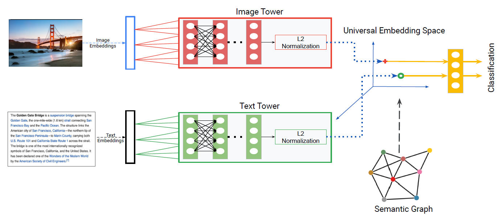

# HUSE
PyTorch implementation of **HUSE: Hierarchical Universal Semantic Embeddings**

Classification task involving cross-modal representation learning corresponding to images and text. **HUSE** projects images and text into a **shared latent space** by using a shared classification layer for image and text modalities. It incorporates semantic information into a **universal embedding space**. The original paper referenced can be found [here](https://arxiv.org/abs/1911.05978).

### Data
For this implementation, images from the a retail store has been used. The images can be found in **./images** folder, and the corresponding **.csv** files for both training and validation can be found at **./data/** folder.

### Prerequisites
* `python >= 3.6`
* `pytorch 1.4.0`
* `pytorch-pretrained-bert 0.6.2` find it [here](https://pypi.org/project/pytorch-pretrained-bert/).
* `sentence-transformers 0.2.6.1` find it [here](https://pypi.org/project/sentence-transformers/).

### Usage
Train model
```bash
python main.py train --csv_file_path </path/to/train/csv/file> --batch_size 4 --epochs 100 --save_model_dir </path/to/save-model/folder> --cuda 1
```
* `--csv_file_path` path to the csv file which contains the train image paths and text, default is **./data/train_data.csv**
* `--batch_size` batch size used while training, default is 4
* `--epochs` number of training epochs, default is 100
* `--save_model_dir` path to folder where trained model will be saved, default is **./saved_models/**
* `--cuda` set it to 1 for running on GPU, 0 for CPU. (default is 1)

Evalutating the model
```bash
python main.py eval --csv_file_path </path/to/eval/csv/file> --model </path/to/saved/model> --cuda 1
```
* `--csv_file_path` path to the csv file which contains the validation image paths and text, default is **./data/eval_data.csv**
* `--model` saved model to be used for evaluating the images
* `--cuda` set it to 1 for running on GPU, 0 for CPU. (default is 1)

Refer to ./main.py for other command line arguments.

### Model Architecture

Image embeddings and text embeddings are passed through their respective towers to get universal embeddings. These embeddings are passed through a shared hidden layer. The semantic graph is used to regularize the universal embedding space.

### Citation
>

    @misc{narayana2019huse,
    title={HUSE: Hierarchical Universal Semantic Embeddings},
    author={Pradyumna Narayana and Aniket Pednekar and Abishek Krishnamoorthy and Kazoo Sone and Sugato Basu},
    year={2019},
    eprint={1911.05978},
    archivePrefix={arXiv},
    primaryClass={cs.CV}
     }
